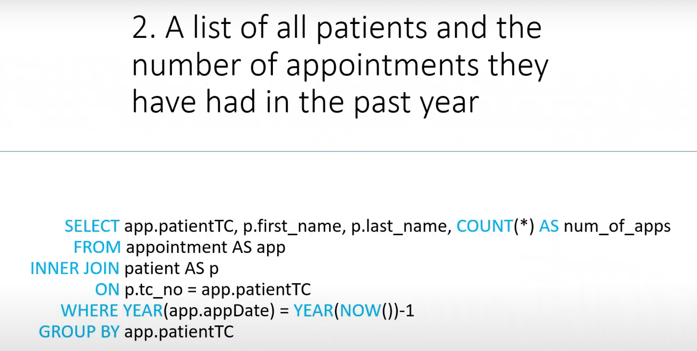

# Hospital Management System 

 

**You can watch the full presentation of our project which is mainly focused on the design of the database by clicking [here!](https://www.youtube.com/watch?v=RfWCqz8Vvac)**

 

As a team of 5 students, we gathered a huge variety of information by researching then created a single table with some fake personas to imitate a functioning hospital. After that, we pinpointed the attributes that should be primary/secondary keys. Finally, we formed a 3NF relational database from scratch by writing the SQL queries that we wrote and run on the MySQL server.

 

## The E-R Diagram of our Database

 

 

## SQL Queries for Creating a Database in Third Normalized form
1. [Creating the UNF table](sql-queries/creating-the-unf-table.md)
2. [Forming 3NF tables from the UNF table](sql-queries/creating-3nf-tables-from-the-unf.md)
3. [Creating view of Patient Records by joining every table](sql-queries/view-of-patient-records.md)

  

## Custom Queries to make Hospital Management System more functional 

 

- Listing all doctors that have seen a certain patient 

  

 

The actual usage of the query above

 

- Listing all of the patients with the number of appointments they have had in the last year

  

 

The actual usage of the query above

 

- Changing the date of an appointment

  

 

- Listing all doctors that have seen a certain patient 

  

The actual usage of the query above

 

- Adding a new doctor to the system

  

 

The actual usage of the query above

 

- Removing an appointment from the system

  

 

The actual usage of the query above

 
